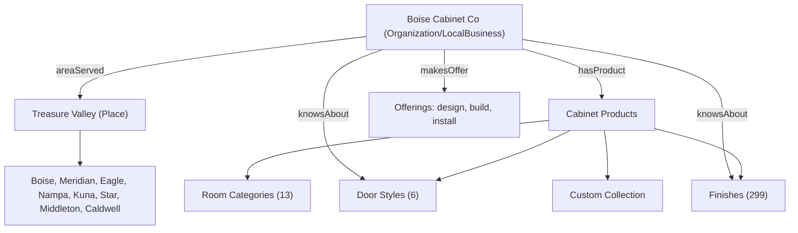

# Entity Map - Boise Cabinet Co

Goal: make the brand, services, products, and place entities unambiguous to search engines and AI systems.

## Core organization entity

- Name: Boise Cabinet Co (legal: Boise Cabinet Co LLC)
- Type: LocalBusiness + FurnitureStore (consider also HomeAndConstructionBusiness)
- Founded: 2017
- Place: Kuna, ID (HQ) serving the Treasure Valley
- @id: site base URL (stable entity anchor)
- sameAs: Facebook, Instagram (verify) + ADD Google Business Profile, Houzz, BBB, Yelp when available

## Entity relationships

## Entity inventory

| Entity class | Instances | Schema vehicle | Status |
|---|---|---|---|
| Organization/Brand | Boise Cabinet Co | Organization, LocalBusiness, WebSite | OK; add sameAs profiles |
| Place / service area | Treasure Valley + 8 cities | LocalBusiness.areaServed (City) | OK |
| Product (category) | base/wall/tall/vanity... (9) | CollectionPage / Product | Category schema MISSING |
| Product (SKU) | 320 | Product | thin; noindex |
| Door style | 6 | (none) | add knowsAbout / Product context |
| Finish/color | 299 | (none) | add Product/color for indexable subset |
| Collection | custom (1) | (none distinct) | add Product/ProductGroup |
| Service/offering | design, build, install | OfferCatalog (broken URLs) | FIX URLs to /cabinets/* |
| Author/person | none | (none) | ADD founder/team Person entities |
| Reviews | none | Review/AggregateRating | ADD when real data |

## Missing / weak entities

1. Person entities (founder, designers, lead installer) - critical for E-E-A-T and author authority. Add to About + Organization `founder`/`employee` + author bylines on guides.
2. AggregateRating/Review - no rating entity emitted. Add once real review data exists.
3. Service offerings point to non-existent `/services/*` URLs - repoint to `/cabinets/*` and room/category entities.
4. Product/color entities for finishes and door styles - add structured data so AI can enumerate the catalog.
5. GBP entity link (sameAs) - the strongest local entity signal; currently absent.

## Entity confusion to resolve

- Legacy "remodeling" vocabulary + `SERVICES` slugs (`kitchen-remodel`, `adu`, `room-addition`) still drive schema offers. Rename to cabinet semantics; repoint URLs.
- Finish count conflict (108 vs 299) creates a factual inconsistency AI may surface; standardize to 299.
- `llms.txt` lists 3 door styles vs 6 in catalog - update.

## Recommended entity reinforcement

- Add explicit `knowsAbout` array on Organization (kitchen cabinets, bathroom vanities, frameless construction, soft-close hardware, cabinet finishes, Treasure Valley).
- Add `areaServed` GeoShape or named cities consistently across LocalBusiness + Service schema.
- Add `Person` schema for named team with `jobTitle`, link as `author`/`founder`.
- Keep one canonical `@id` per entity across all pages.
