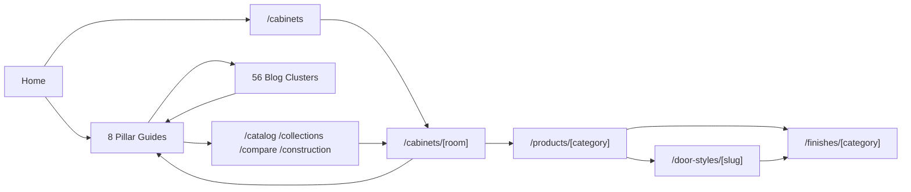

# Internal Linking Plan - Boise Cabinet Co

System: `scripts/internal-links/generate.ts` (+ `lib.ts`) builds `data/internal-links.json` from blog posts, guides, and catalog pages using Jaccard similarity + hub/category/tag bonuses + type quotas + a minimum-incoming-links swap pass. Audited by `scripts/internal-links/audit.ts` (prebuild). Runtime: `components/marketing/RelatedPostCards.tsx`.

Current: 86 pages, 536 outbound links, avg 6.23 incoming/page. No orphans, no broken manifest links, but 38 pages below 5 incoming links.

## Issues

| Issue | Detail | Action |
|---|---|---|
| Cluster links use `replacesSlug` | `GuidePageLayout` L123 links `/blog/{replacesSlug ?? slug}` -> non-canonical | Use `c.slug` |
| Broken guide hrefs | `locationGuides.ts` L54-60 plural slugs | Fix to real slugs |
| 38 weak pages | <5 incoming (e.g. `cabinet-consultation-process` = 1) | Add manual overrides / sibling links |
| Catalog isolation | Cabinet grids on `/cabinets/[room]` do not link to `/products/*`; finishes/products/rooms/doors weakly cross-linked | Add cross-links |
| Local-guides breadcrumb | empty `pillarSlug` -> `/guides/` crumb | Skip hub crumb or link master guide |

## Target architecture (hub-and-spoke + catalog mesh)

## Linking rules to enforce

1. Every indexable page: >= 5 incoming internal links.
2. Pillars: link down to all their clusters (using canonical `slug`) + up to `/cabinets`, `/collections`, `/compare`.
3. Clusters: link up to their pillar + 2 catalog pages + 2 sibling clusters.
4. Room pages: link to relevant product categories, recommended door styles, and a related guide.
5. Door-style + finish category pages: cross-link to each other and to room pages and the design studio.
6. Product category pages: link to parent room(s), compatible door styles/finishes, and the relevant cost cluster.
7. Conversion anchors (`#consult`, `/estimate`, `/design-studio`) reachable within 2 clicks from every money page.
8. Contact in primary nav (currently footer-only).

## Implementation steps

1. Fix `GuidePageLayout` to use `slug`.
2. Fix/redirect broken guide hrefs in `locationGuides.ts`, `resourcePdfContent.ts`, permit page.
3. Add cross-links in catalog templates (room->product, product->door/finish).
4. Add manual `relatedLinks` overrides for the 38 weak pages.
5. Re-run `npm run links:generate` then `npm run audit:links`; target 0 pages <5 incoming.

## Verification

- `audit:links` reports 0 orphans, 0 broken links, 0 pages <5 incoming.
- Manual spot check: crawl depth from home to any money page <= 3.
